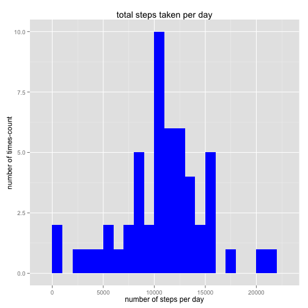
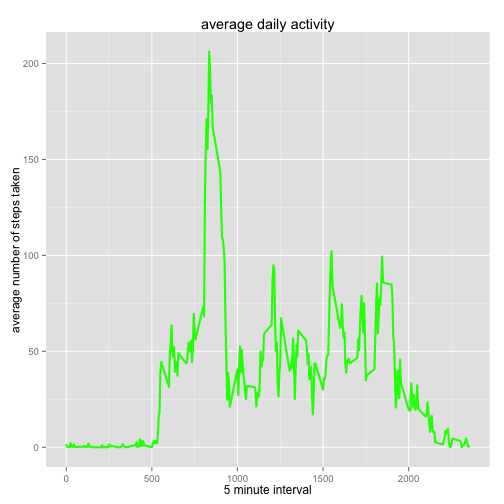
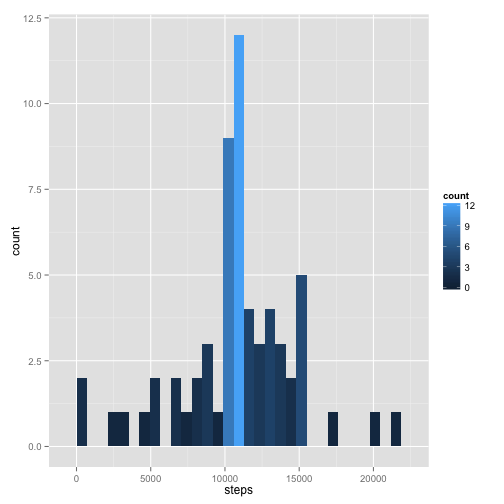
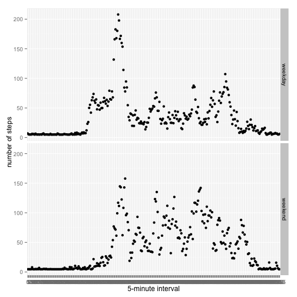

Program Assignment #1 - Reproducible Research
========================================================
Introduction

This document is solution for assignment #1 from Reproducible Research from coursera.  The primary tools are using RMarkdown to display the integration of text and 'r'code that is displayed in HTML.

This assignment makes use of data from a personal activity monitoring device. This device collects data at 5 minute intervals through out the day. The data consists of two months of data from an anonymous individual collected during the months of October and November, 2012 and include the number of steps taken in 5 minute intervals each day.

Dataset in Analysis:
The variables included in this dataset are steps, date, and interval.  There are 17568 observations.
  steps: Number of steps taking in a 5-minute interval (missing values are coded as NA)
  date: The date on which the measurement was taken in YYYY-MM-DD format
  interval: Identifier for the 5-minute interval in which measurement was taken

Assignment:
Fork/clone the GitHub repository created for this assignment. The assignment is pushed to your repository on GitHub. The assignment submission consists of the URL to your GitHub repository and the SHA-1 commit ID for your repository state.

Loading Libraries

```r
library(ggplot2)
```
Loading the Data

```r
connection <- unz("activity.zip","activity.csv")
data <- read.csv("activity.csv", sep = ",", header = TRUE)
```
Preprocessign the Data

```r
data$date <- as.Date(data$date, format="%m/%d/%y")
data$interval <- as.factor(data$interval)
```
Q1. What is the mean total number of steps taken per day?

1.1 Calculate the total number of steps taken per day

```r
steps.per.day <- aggregate(steps~date, data, sum)
colnames(steps.per.day) <- c("date", "steps")
```
1.2 Plot Histogram of Total Number of Steps Taken Each Day

```r
g <- ggplot(steps.per.day, aes(x=steps))
g <- g + geom_histogram(fill="blue", binwidth=1000) + labs(x="number of steps per day",y="number of times-count", title="total steps taken per day") 
print(g)
```

 
1.3. Calculate and report the mean and median of the total number of steps taken per day

```r
mean.steps <- mean(steps.per.day$steps, na.rm=TRUE)
mean.steps
```

```
## [1] 10766.19
```

```r
median.steps <- median(steps.per.day$steps, na.rm=TRUE)
median.steps
```

```
## [1] 10765
```
The Mean and Median steps are 10766 and 10765 steps, respectively.

Q2.What is the average daily activity pattern?
2.1 Make a time series plot of the 5 minute interval (x-axis) by the average number of steps taken, averaged across all days (y-axis)

```r
steps.per.day <- aggregate(steps~date, data, sum)
steps.per.interval <- aggregate(data$steps, by=list(interval=data$interval), FUN=mean, na.rm=TRUE)
```
convert to integers for plotting

```r
steps.per.interval$interval <- as.integer(levels(steps.per.interval$interval)[steps.per.interval$interval])
colnames(steps.per.interval) <- c("interval", "steps")
ggplot(steps.per.interval, aes(x=interval, y=steps)) + geom_line(color="green", size=1) + labs(x="5 minute interval", y="average number of steps taken", title="average daily activity")
```

 
2.2 Which 5 minute interval, on average across all days in the dataset, contains the maximum number of steps?

```r
max.step.interval <- steps.per.interval[which.max(steps.per.interval$steps),]
max.step.interval
```

```
##     interval    steps
## 104      835 206.1698
```
The interval that has the maximum number of steps is, 835

Q3.  How to Manage Missing Values
There are a number of days/intervals where there are missing values (coded as NA)
calculate the total number of missing values in the dataset

```r
length(which(is.na(data$steps)==TRUE))
```

```
## [1] 2304
```
3.1, 3.2 Fill in all the missing values in the dataset, with the mean

```r
mean(na.omit(data$steps)) 
```

```
## [1] 37.3826
```
3.3 Create a new dataset replacing NAs with values, in this case mean for data

```r
data.new <- data
data.new$steps[is.na(data.new$steps)] <- mean(na.omit(data.new$steps))
```
3.4 Make a histogram of total number of steps taken each day with the new data set. Compare mean and median to the data set that includes NA (first part of assignment)

```r
new.steps.per.day <- aggregate(steps ~ date, data = data.new, FUN = sum)
ggplot(new.steps.per.day, aes(x=steps)) +
  geom_histogram(aes(fill = ..count..))
```

```
## stat_bin: binwidth defaulted to range/30. Use 'binwidth = x' to adjust this.
```

 

```r
mean(new.steps.per.day$steps)
```

```
## [1] 10766.19
```

```r
median(new.steps.per.day$steps)
```

```
## [1] 10766.19
```
Q4. Are there differences in activity patterns between weekdays and weekends?

4.1 Create a new variables and add to data set if observation is on weekday, or weekend in the dataset

```r
weekend.weekday <- function(date) {
    day <- weekdays(date)
    if (day %in% c("Monday", "Tuesday", "Wednesday", "Thursday", "Friday")) 
        return("weekday") else if (day %in% c("Saturday", "Sunday")) 
        return("weekend") else stop("invalid date")
}
data.new$date <- as.Date(data.new$date)
data.new$day <- sapply(data.new$date, FUN = weekend.weekday)
```
4.2. Make a panel plot containing a time series plot of the 5-minute interval (x-axis) and the average number of steps taken, across all weekday days or weekend days.

```r
averages <- aggregate(steps ~ interval + day, data = data.new, mean)
ggplot(averages, aes(interval, steps)) + geom_point() + 
    labs(x="5-minute interval", y= "number of steps") + facet_grid(day ~ .) 
```

 
